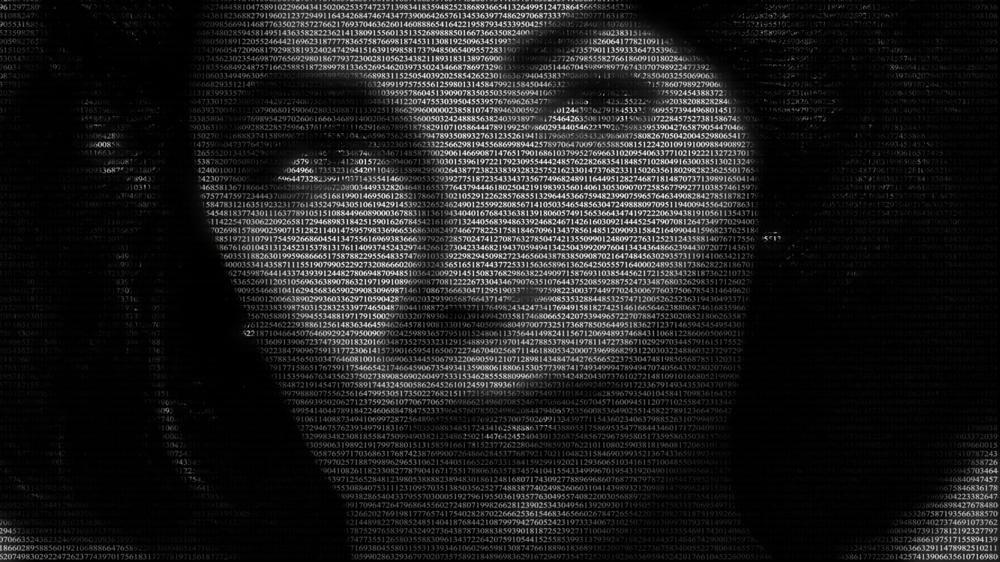

# Facial Recognition

 

Easily use your own facial recongition system in python with flexibility.
You can also easily modify the components used to try and improve on the
accuracy of the recognition system. Currently, the system can achieve 85% accuracy.

Facial recognition can be useful for a wide range of categories including
access control and security. This system is very easy to modify for use
on whatever use case you have in mind.

**How it Works**

The system currently uses the inception model to produce a 128 encdoing
(1x128) for a given image. These encodings are saved to a pickle file and
loaded when running the facial recognition. When running the facial recognition
program new images (of detected faces) are passed through the model and
their values compared with encodings stored in the 'database'. When the distance
between the input encoding and the database encoding is lower than a set threshold
then we have a match.


 


## How to Use

1. **Take a picture:** To start you have to take a face picture for the database.
Run the script
```bash
$> python3 take_picture.py
```
This will open up your webcamera. When a black box appears over your face you
can hit enter to take the picture. A success log should appear in the console.
You only really need 1 image but you are free to take more if you want. These
images are saved to the images folder in the project directory.

2. **Create Identities:** A very simple stage. Navigate to the images directory
within your project's directory. You will find your image(s) that were captured
in step 1. Simply move the different face pictures in to respective folders to represent
their identities. E.g. if you took 1 picture and it is there in the images folder then
create a new folder within the images folder with your name as the folder name and move the
image to that folder.

3. **Refresh the Database:** Now all you have to do is run
```bash
$> python3 refresh_database.py
```
This will update the identities that will be recognized later. When this stage
completes you will find a database.pickle in the database folder within your
project directory. The database.pickle file is needed for the next stage.
Once it is done refreshing you should get a notification that refreshing has completed.

This script also accepts the '--use_avg' argument. When used it means that when
there are multiple images in a folder (which represents a person) then it will take the
encodings for all images and average it to get a 1x128 tensor with average values.
If this flag is ommited it will default to storing encodings for all images in each folder
and so 1 person may have multiple encodings. You might want to use the --use_avg flag in
order to reduce running time to perform comparisions. You can use this flag by running the script as follows:
```bash
$> python3 refresh_database.py --use_avg
```

4. **Facial Recognition:** That's it! You're now all setup to run the facial recognition
system. Run:
```bash
$> python3 facial_recognition.py
```
Once it starts up you should receive a desktop notification and you will see a window
with a feed from your webcamera. When the system recognizes any of the various
identities provided it will show the name and the percentage acurracy in the window.

*You can try modify the program by trying different parameters to improve accuracy.
You could try increase resolution and input sizes. You could also try use a different model
to see how it affects the accuracy.*

### Installation

In the project directory run the following command to get all dependencies
```bash
$> pip3 install -r requirements.txt
```

#### Requirements

* Python 3.6
* OpenCV (python)
* Tensorflow
* Keras
* (*optional*) plyer (pip install -I https://github.com/kivy/plyer/zipball/master - used to produce a notification when long running tasks complete)

#### To Modify

If you wish to modify the program to achieve better accuracy you may want to concentrate on the following files:

* fr_utils.py - This is where the architecture of the model is defined and where some utility functions are located
 such as encoding images.
* neural_network.py - This is where the model is loaded and provides some utility functions such as creating/loading the database

**Note:**
The current model requires an input of shape 3x96x96 (channel, width, height).
It uses the TensorFlow format for input (channels first). If you use the Theano backend you will need to modify
the input shape in the fr_utils.py. The current model also outputs a 1x128 tensor for an image.
If you wish to modify the input shape and/or output shape you will need to change the
parameters in fr_utils.py and neural_network; particularly the functions producing the encoding.

#### To learn more:

https://www.coursera.org/learn/convolutional-neural-networks/lecture/lUBYU/what-is-face-recognition